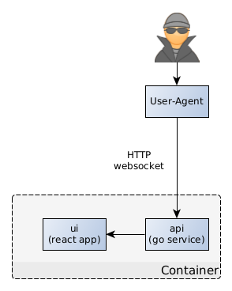
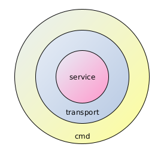
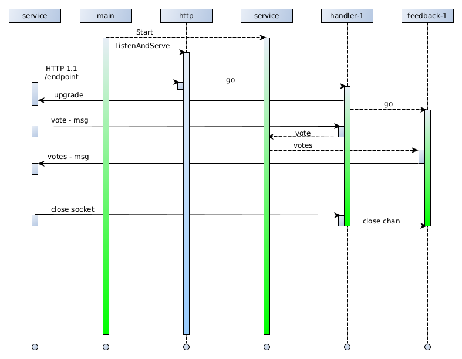

# System Context



The application consists of a React frontend app and a golang backend service.

The backend service serves the static frontend to the user agent via HTTP.

The frontend connects to a websocket endpoint offered by the backend to access 
and manipulate room state.

Following messages are sent by the client to the server:

```json
{
  "action": "JoinRoom",
  "room": 1,
  "name": "Ladi",
  "points": "5"
}
```

The **action** field is always present and determines which other fields are relevant:
* **CreateRoom** - creates a new room, the server responds with a **NewRoom** message for 
the newly created room. No additional fields required.
* **JoinRoom** - user joins a room. Server responds either with a **Votes** messages
when the room is entered successfully or with an **Error** message when the room
already contains a user with the same name. Fields **room** and **name** are required. 
* **LeaveRoom** - user leaves a room. Fields **room** and **user** are required.
* **Vote** - user changes current vote. Fields **room**, **user** and **points**
are required.
* **NewRound** - user starts a new round. Field **room** is required.

Following messages are sent by the server to the client:

```json
{
  "result": "Votes",
  "error": "",
  "room": 1,
  "votes": {
    "Ladi": ""
  }
}
```

The **result** field is always present and determines which other fields are required:
* **Votes** - sent by the server when the status of a room changes in any way.
Fields **room** and **votes** are required. The field **votes** contains a map
of names to currently selected cards. No selection is represented with an empty string.
* **NewRoom** - sent as confirmation by to the client when a new room is created.
Contains only the **room** field.
* **Error** - sent by the server on error. Only the field **error** is required.

# Packages



The service package provides a central room repository.

Clients can manipulate data in the repository by sending messages to it through
a channel.

Clients, which join a room subscribe to room changes by providing a feedback 
channel.

# Concurrency model

The service uses the CSP (Communication Sequential Processes) paradigm to 
handle concurrency. This paradigm is built into the go language using 
the go functions and channels.



* The bootstrap process spawns a room service go routine.
* Then it configures a http router and starts running it in a blocking call.
* The http router delegates the handling of incoming http requests to handlers 
running in individual go routines.
* The websocket handler upgrades the protocol and creates a feedback channel.
* The feedback channel is part of the join room message and is registered in the room.
* The feedback go routine receives messages from the service, translates them to
web socket response messages and sends these to the client.
* The websocket handler reads messages from the connection using a blocking call
in a cycle, which is terminated when the client disconnects.
* The messages from client are translated to room repository messages and sent
to the repository through it's input channel.
* This way the states of the room are exclusively owned and managed by a single
go routine of the service. No locking is necessary.
 