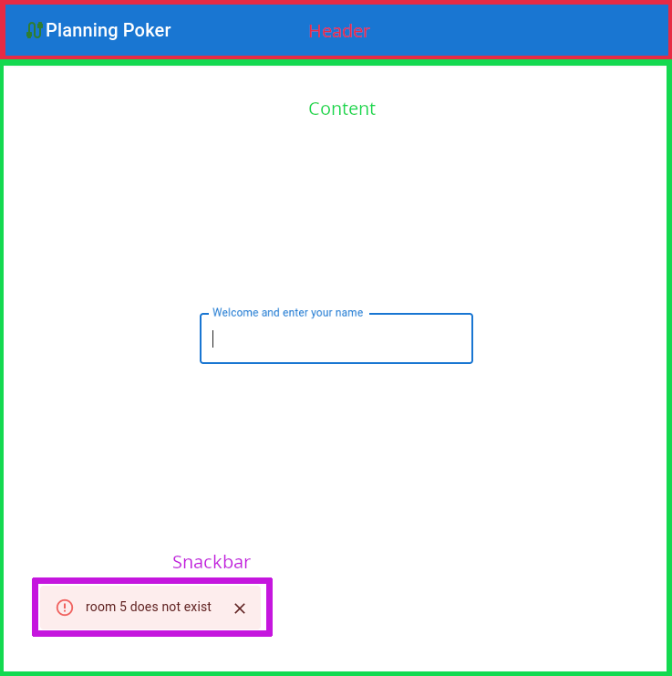
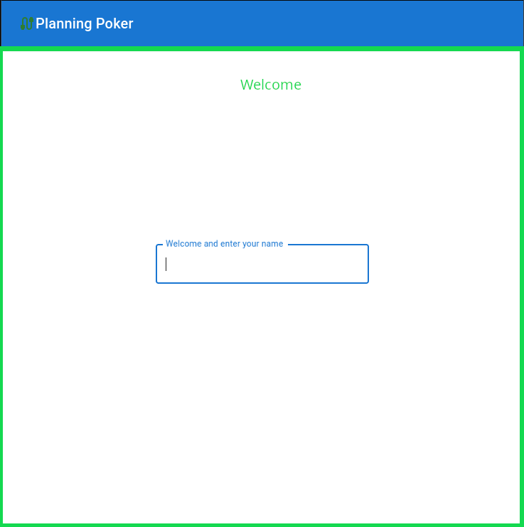
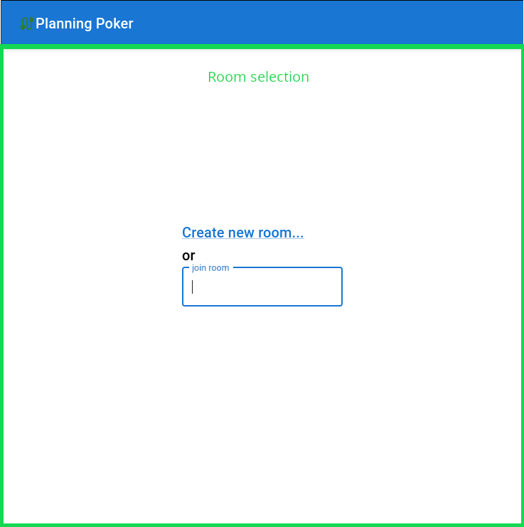
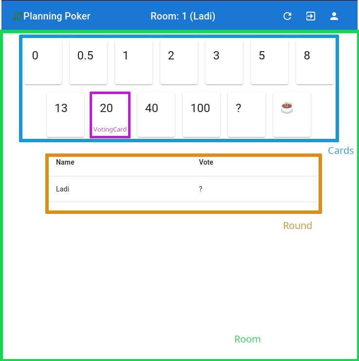

# Thinking in React

https://reactjs.org/docs/thinking-in-react.html

# Step 1 - Break the UI into a component hierarchy

## App



The whole app is built up from three components:
* **Header**
* **Content**
* **Snackbar** - Shows server errors as **Alert**s within a **Snackbar**(standard MUI components)

## Header

Visible all the time, shows different information depending on current content and device size.

Welcome and Room Selection:


* Icon showing the state of the server connection - white = connecting, green = ok, red = error
* Label with application name (hidden on smallest devices)

Room (in addition to information shown in the previous rooms):


* Label with the current room and user name
* "Start new round" button
* "Leave room" button
* "Change name" button

## Content

The content displays different views depending on the current state
* **Welcome** - when the user name is unknown
* **Room selection** - when the user name is known, but the room is unknown
* **Room** - when both, the user name and the room are known

### Welcome



This is the first view encountered by the user on first visit of the app and after "logging out".

It lets the user enter a name (unique within a room, non unique user names are rejected when trying to enter a room).

### Room selection



This view lets the user select a room. This can be done either by creating a new room using a click on the "Create new room..." link, or by entering number of an existing room.

### Room



This view shows the current state of the room the user is in and let's the user vote in the current round.

#### Cards

A grid showing a set of planning poker cards with different values.

#### VotingCard

A card with a specific value.
The current vote of this user is shown with a colorful background.
Clicking on a card, which is not the user's current vote, makes the card current vote. Clicking on the card representing the current vote resets the current vote.

#### Round

This component shows all users in the current room and their votes.

The room can be in two states:
* **revealed** - all users have made a choice, the votes of all users are visible.
* **not revealed** - at least one user did not make a choice yet, all votes are shown as question marks.

# Step 2 - Build a static version in React

Build and style components, use static texts instead of dynamic data.

# Step 3 - Identify the  minimal (but complete) representation of UI state

The following questions help to identify mutable state from static properties:
1. Is it passed in from a parent via props? If so, it probably isn't state.
2. Does it remain unchanged over time? If so, it probably isn't state.
3. Can you compute it based on any other state or props in your component? If so, it isn't state.

Our state:
* **Name**
* **Room number**
* **Votes** - map of user names to their current vote
* **Current error from server**

Not a state:
* **Connection status** - provided by the useWebSocket hook
* **Current vote** - can be derived from the room status

# Step 4 - Identify where your state should live

For each piece of state in your application:

* Identify every component that renders something based on that state.
* Find a common owner component (a single component above all the components that need the state in the hierarchy).
* Either the common owner or another component higher up in the hierarchy should own the state.
* If you can’t find a component where it makes sense to own the state, create a new component solely for holding the state and add it somewhere in the hierarchy above the common owner component.

**Name**
* Used in
    * Header - display
    * Welcome - input
    * Room - calculate current vote from votes map
* Common ancestor -> App

**Room number**
* Used in
    * Header - display
    * RoomSelection - input
* Common ancestor -> App

**Votes**
* Used in
    * Room
* Common ancestor -> Room

**Current error**
* Used in
    * Snackbar
* Common ancestor -> Snackbar

All the state, we identified, is also a part of the communication with the server:
* The name and the room number is sent to the server as part of the request.
* The votes and the current error are retrieved from the response.

We only want to have one connection to the server open at a time. For this concern we could think of the server communication as of a virtual component using the state. As this component uses all our states, the **App** component will become the common ancestor of all our state fields.

To simplify the code and hide the websocket communication from the application, we will create a custom hook called **useRoom**.

This hook will be used by the **App** component and return the current state elements:

```tsx
const useRoom = () : {
  room: number | undefined
  name: string | undefined
  readyState: ReadyState
  votes: Record<string, string>
} => {
    // ...
}
```

This state will be passed from the **App** component to it's children as needed.

The custom hook will also make it possible to implement the complete UI using sample data first and add the websocket communication later.


# Step 5 - Add inverse data flow

## Client state only first

In this step we pass the state change callbacks down to children, which invoke them whenever the state needs to be altered.

The interface of our useRoom hook will become something like:
```tsx
interface Room {
  room: number | undefined
  name: string | undefined
  readyState: ReadyState
  votes: Record<string, string>
  setName: (name: string | undefined) => void
  createRoom: () => void
  joinRoom: (no: number) => void
  leaveRoom: () => void
  startNewRound: () => void
  vote: (points: string) => void
}

const useRoom = (showError: (error: string) => void): Room => {
    // ...
}
```

It consumes a callback for displaying a new server error in a Snackbar called **showError**.

In addition to the current state it now provides a set of callbacks to manipulate the state:
* **setName** - sets the name
* **createRoom** - sets room to 1, creates votes map with two dummy users
* **joinRoom**
    * invokes showError with an error message when the new room number is not equal to 1
    * sets room to the parameter of the callback
    * includes the current user in the votes map
* **leaveRoom** - sets room to undefined, removes user from the votes map
* **startNewRound** - resets all votes to ''
* **vote** - sets the vote of current user to parameter of the callback

When we are done with this step, we will have a fully functional user interface without the connection to the backend.


## Websocket integration next

The **react-use-websocket** library (https://www.npmjs.com/package/react-use-websocket) provides a websocket implementation in form of a hook, which integrates nicely with React's function components.

The integration will be implemented along these lines:
* Call **useWebSocket** from **useRoom**
* Have the callbacks **createRoom**, **joinRoom**, **leaveRoom**, **startNewRound** and **vote** send a message to the server instead of manipulating the state directly
* Include an effect, which processes incoming messages:
    * **Error** - calls the **showError** callback
    * **NewRoom** - updates **room number** state variable and sends a **joinRoom** message to the server
    * **Votes** - updates **room number** and votes state variables
